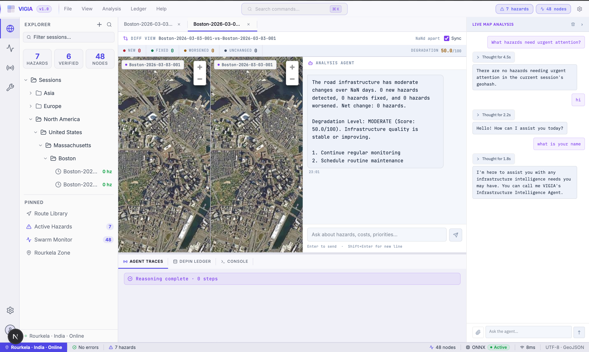

<p align="center">
  
</p>

# VIGIA

<p align="center">
  
</p>

VIGIA is a sentient road infrastructure platform: smartphones generate signed, privacy-preserving telemetry; AWS verifies events with agentic reasoning; and the system renders hazards, routing, and maintenance outcomes in a VS Code-inspired interface.

**Competition**: Amazon 10,000 AIdeas (Semi-Finalist)  
**Deployment**: AWS (us-east-1), serverless (scales to zero)

## Project status

- **Implementation**: 197/197 tasks complete
- **Tests**: 31/31 passing (90% coverage)
- **Performance targets**: diff computation 1.2s, ReAct latency 320ms
- **Budget**: $1.39 for the 7-day voting phase (target: <$1.50)

---

## What this repo contains

VIGIA is a monorepo (npm workspaces) with three primary packages:

- `packages/frontend`: Next.js (App Router) dashboard UI (MapLibre, ONNX Runtime Web, Web Workers)
- `packages/backend`: AWS-facing logic and action implementations (includes Python agent tools)
- `packages/infrastructure`: AWS CDK stacks (DynamoDB, Lambda, API Gateway, Bedrock integration, Location Service)

The detailed, authoritative system documentation lives in the docs folder:

- [docs/README.md](docs/README.md)
- [docs/1-requirements.md](docs/1-requirements.md)
- [docs/2-system-design.md](docs/2-system-design.md)
- [docs/3-component-specs.md](docs/3-component-specs.md)
- [docs/4-master-task-list.md](docs/4-master-task-list.md)

---

## Core capabilities

- **Edge hazard detection**: frame extraction at 5 FPS and YOLOv8-nano inference in a dedicated Web Worker (ONNX Runtime Web)
- **Cryptographic trust**: ECDSA P-256 signed telemetry; server-side signature verification
- **Privacy controls**: client-side anonymization (blur faces and license plates) before AI processing
- **Agent verification and explainability**: Nova Lite-based verification with ReAct traces (Thought → Action → Observation)
- **Tamper-evident ledger**: append-only DePIN ledger with a SHA-256 hash chain and stream-based integrity validation
- **Map + routing**: MapLibre visualization with Amazon Location Service routes; hazard-aware route coloring
- **Innovation features**: infrastructure diffs, scenario branching, maintenance queue, and ROI metrics
- **Local-only analysis**: diff state and scenario branches remain local unless explicitly exported

For the full functional and non-functional requirements, see [docs/1-requirements.md](docs/1-requirements.md).

---

## System architecture (five-zone model)

High-level flow (source-of-truth: [docs/2-system-design.md](docs/2-system-design.md)):

1. **Web Edge**: Next.js UI + Web Workers generate signed telemetry
2. **Ingestion funnel**: API Gateway + Validator Lambda validate schema/signature and write to DynamoDB
3. **Intelligence core**: DynamoDB Streams trigger orchestration; Bedrock agent verifies and produces traces
4. **Trust layer**: ledger append + hash-chain validation
5. **Visualization**: Amazon Location Service + MapLibre render hazards and routing

Data model overview:

- Hazards (geohash/time-series)
- Agent traces (ReAct logs)
- Ledger (hash chain)
- Maintenance queue (repair reports)
- Economic metrics (ROI analysis)
- Cooldown (ephemeral dedupe)

See [docs/DATA_ECOSYSTEM.md](docs/DATA_ECOSYSTEM.md) and [docs/DATA_INFRASTRUCTURE_VISUAL.md](docs/DATA_INFRASTRUCTURE_VISUAL.md).

---

## Demo dataset

VIGIA includes a seeding script designed to produce a demo-ready dataset across 10 global cities.

- Quick reference for judges: [docs/DEMO_DATA_GUIDE.md](docs/DEMO_DATA_GUIDE.md)
- Dataset verification report: [docs/SEEDING_VERIFICATION_REPORT.md](docs/SEEDING_VERIFICATION_REPORT.md)
- Infrastructure + dataset executive summary: [docs/INFRASTRUCTURE_SUMMARY.md](docs/INFRASTRUCTURE_SUMMARY.md)

Note: depending on how many times seeding has been run in an environment, you may see larger counts than the baseline (the verification report records a 2,800+ record environment).

---

## Getting started (local)

### Prerequisites

- Node.js 20+
- AWS CLI authenticated to an AWS account
- AWS CDK v2

### Install

```bash
npm install
```

### Deploy infrastructure

```bash
npm run cdk:deploy
```

### Seed demo data

```bash
node scripts/seed-comprehensive-demo-data.js
```

### Run the frontend

```bash
npm run dev
```

---

## Configuration

Create `packages/frontend/.env.local`:

```bash
NEXT_PUBLIC_AWS_REGION=us-east-1
NEXT_PUBLIC_API_GATEWAY_URL=<YOUR_API_GATEWAY_URL>

# If using the deployed Bedrock agent integration
NEXT_PUBLIC_BEDROCK_AGENT_ID=TAWWC3SQ0L
NEXT_PUBLIC_BEDROCK_AGENT_ALIAS_ID=<YOUR_ALIAS_ID>
```

---

## Pin-based route planning

VIGIA supports dropping two pins (A/B) and comparing fastest vs. safest routes.

- Implementation details: [docs/PIN_ROUTING_IMPLEMENTATION.md](docs/PIN_ROUTING_IMPLEMENTATION.md)
- Deployment + test report: [docs/PIN_ROUTING_DEPLOYMENT_REPORT.md](docs/PIN_ROUTING_DEPLOYMENT_REPORT.md)

---

## Development and testing

```bash
npm test
```

---

## License

Apache License 2.0 - See [LICENSE](LICENSE)

---

## Contributing

This is a competition project. Contributions are not currently accepted.
