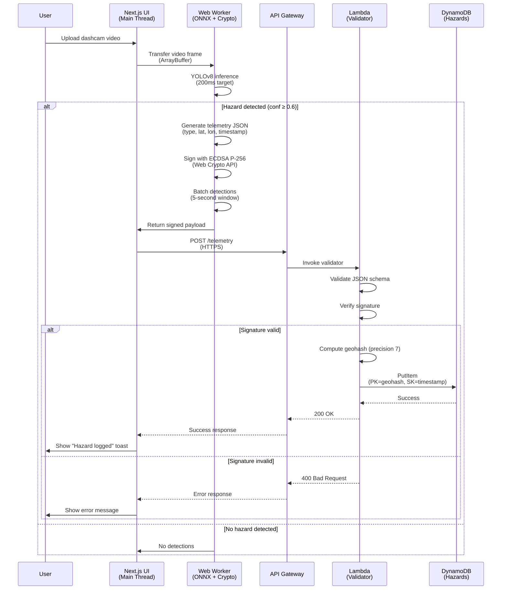
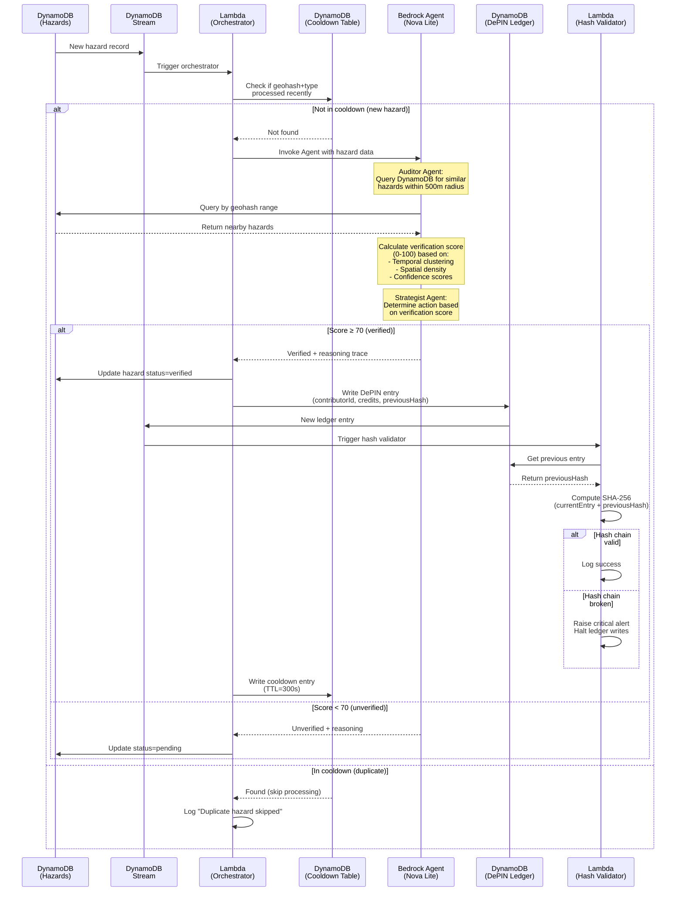
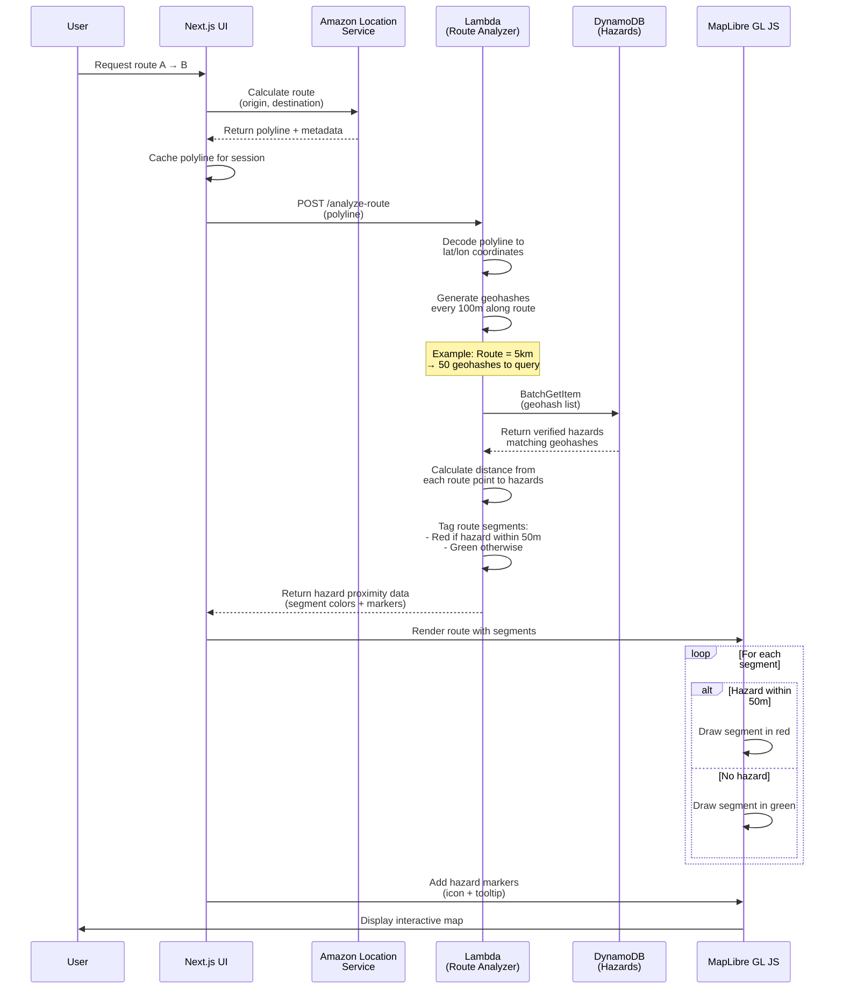

# VIGIA: System Design Document
**Project**: Sentient Road Infrastructure System  
**Competition**: Amazon 10,000 AIdeas (Semi-Finalist)  
**Architecture**: Hybrid Hierarchical Multi-Agent System (H-HMAS)  
**Version**: 1.0  
**Date**: 2026-02-26

---

## 1. Executive Summary

VIGIA transforms the global network of smartphones into a real-time "sentient infrastructure" for road safety. This document formalizes the production-grade architecture optimized for AWS Free Tier operation during the community voting phase (March 13–20, 2026).

**Key Design Principles:**
- **Serverless-First**: Zero idle costs, auto-scaling
- **Edge Intelligence**: AI inference runs in-browser via Web Workers
- **Cost-Optimized**: Strict adherence to AWS Free Tier limits
- **Privacy-Preserving**: No raw video transmission; client-side anonymization
- **DePIN-Ready**: Append-only ledger with cryptographic hash chain

---

## 2. System Architecture Overview

### 2.1 High-Level Architecture

```
┌─────────────────────────────────────────────────────────────────┐
│                         ZONE 1: WEB EDGE                        │
│  ┌──────────────┐         ┌─────────────────────────────────┐  │
│  │ Next.js UI   │◄────────┤   Dedicated Web Worker          │  │
│  │ (Amplify)    │         │  - YOLOv8 ONNX Inference        │  │
│  │              │         │  - Web Crypto Signing           │  │
│  │ - Video UI   │         │  - Telemetry Batching           │  │
│  │ - MapLibre   │         └─────────────────────────────────┘  │
│  │ - Analytics  │                                               │
│  └──────┬───────┘                                               │
└─────────┼───────────────────────────────────────────────────────┘
          │ HTTPS POST (Signed Telemetry)
          ▼
┌─────────────────────────────────────────────────────────────────┐
│                      ZONE 2: INGESTION FUNNEL                   │
│  ┌──────────────┐         ┌─────────────────────────────────┐  │
│  │ API Gateway  │────────►│   Lambda (Validator)            │  │
│  │ (REST)       │         │  - Schema Validation            │  │
│  │              │         │  - Signature Verification       │  │
│  │              │         │  - Geohash Computation          │  │
│  └──────────────┘         └────────┬────────────────────────┘  │
└─────────────────────────────────────┼───────────────────────────┘
                                      │ Write
                                      ▼
┌─────────────────────────────────────────────────────────────────┐
│                   ZONE 3: INTELLIGENCE CORE                     │
│  ┌──────────────────────────────────────────────────────────┐  │
│  │              DynamoDB (Hazards Table)                    │  │
│  │  PK: geohash  |  SK: timestamp  |  hazardType | conf    │  │
│  └────────┬─────────────────────────────────────────────────┘  │
│           │ DynamoDB Stream                                     │
│           ▼                                                      │
│  ┌──────────────────────────────────────────────────────────┐  │
│  │   Lambda (Agent Orchestrator)                            │  │
│  │   - Check Cooldown Table (TTL=300s)                      │  │
│  │   - Invoke Bedrock Agent if new hazard                   │  │
│  └────────┬─────────────────────────────────────────────────┘  │
│           │                                                      │
│           ▼                                                      │
│  ┌──────────────────────────────────────────────────────────┐  │
│  │   Agents for Amazon Bedrock (Nova Lite)                  │  │
│  │   ┌────────────────┐      ┌──────────────────┐          │  │
│  │   │ Auditor Agent  │      │ Strategist Agent │          │  │
│  │   │ - Verify via   │─────►│ - Alert or Log?  │          │  │
│  │   │   spatial query│      │ - Calc credits   │          │  │
│  │   └────────────────┘      └──────────────────┘          │  │
│  └────────┬─────────────────────────────────────────────────┘  │
└───────────┼─────────────────────────────────────────────────────┘
            │ If verified (score ≥ 70)
            ▼
┌─────────────────────────────────────────────────────────────────┐
│                     ZONE 4: TRUST LAYER                         │
│  ┌──────────────────────────────────────────────────────────┐  │
│  │         DynamoDB (DePIN Ledger - Append Only)            │  │
│  │  contributorId | hazardId | credits | previousHash |     │  │
│  │                                       currentHash         │  │
│  └────────┬─────────────────────────────────────────────────┘  │
│           │ DynamoDB Stream                                     │
│           ▼                                                      │
│  ┌──────────────────────────────────────────────────────────┐  │
│  │   Lambda (Hash Chain Validator)                          │  │
│  │   - Verify currentHash = SHA256(entry + previousHash)    │  │
│  └──────────────────────────────────────────────────────────┘  │
└─────────────────────────────────────────────────────────────────┘
            │ Query for visualization
            ▼
┌─────────────────────────────────────────────────────────────────┐
│                  ZONE 5: VISUALIZATION LAYER                    │
│  ┌──────────────────────────────────────────────────────────┐  │
│  │   Amazon Location Service                                │  │
│  │   - Map Tiles (MapLibre GL JS)                           │  │
│  │   - Route Calculation API                                │  │
│  └────────┬─────────────────────────────────────────────────┘  │
│           │                                                      │
│           ▼                                                      │
│  ┌──────────────────────────────────────────────────────────┐  │
│  │   Lambda (Route Hazard Analyzer)                         │  │
│  │   - Decode polyline                                      │  │
│  │   - Generate geohashes along route                       │  │
│  │   - Query DynamoDB for hazards                           │  │
│  │   - Return hazard proximity data                         │  │
│  └──────────────────────────────────────────────────────────┘  │
└─────────────────────────────────────────────────────────────────┘
```

---

## 3. Data Flow Sequence Diagrams

### 3.1 Telemetry Generation & Ingestion



### 3.2 Agent-Based Verification & DePIN Ledger



### 3.3 Safest Route Calculation



---

## 4. Component Design Specifications

### 4.1 Zone 1: Web Edge (Frontend)

#### 4.1.1 Technology Stack
- **Framework**: Next.js 14 (App Router)
- **Hosting**: AWS Amplify (SSR + Static)
- **Map Library**: MapLibre GL JS v3
- **AI Runtime**: ONNX Runtime Web v1.17
- **Model**: YOLOv8-nano (converted to ONNX format)
- **Worker Communication**: Comlink v4
- **Styling**: Tailwind CSS (dark mode, Kiro-inspired design system)

#### 4.1.2 Web Worker Architecture

**Main Thread Responsibilities:**
- Video playback UI (HTML5 `<video>` element)
- Map rendering and interaction (MapLibre)
- React state management and routing
- Display reasoning traces from Bedrock
- Render DePIN ledger ticker

**Web Worker Responsibilities:**
- Load and cache YOLOv8 ONNX model
- Extract frames from video at 5 FPS
- Run object detection inference
- Apply privacy blur filter (if enabled)
- Generate telemetry payloads
- Sign payloads with Web Crypto API (ECDSA P-256)
- Batch detections over 5-second windows

**Communication Protocol:**
```typescript
// Main → Worker
interface FrameMessage {
  type: 'PROCESS_FRAME';
  frameBuffer: ArrayBuffer; // Transferable
  timestamp: number;
  gpsCoords: { lat: number; lon: number };
  privacyMode: boolean;
}

// Worker → Main
interface DetectionMessage {
  type: 'DETECTION_RESULT';
  telemetry: SignedTelemetry | null;
  inferenceTime: number;
}

interface SignedTelemetry {
  hazardType: 'POTHOLE' | 'DEBRIS' | 'ACCIDENT' | 'ANIMAL';
  lat: number;
  lon: number;
  timestamp: string; // ISO 8601
  confidence: number;
  signature: string; // Base64-encoded ECDSA signature
}
```

#### 4.1.3 UI Layout (4-Zone Dashboard)

**Zone A: Sentinel Eye (Left Panel - 25% width)**
- Video player with playback controls
- Privacy toggle button (blur faces/plates)
- Real-time terminal showing telemetry feed
- Frame rate indicator (FPS)

**Zone B: Cloud Swarm Logic (Center Panel - 25% width)**
- Reasoning trace window (scrollable)
- Display Bedrock Agent thoughts in ReAct format:
  ```
  💭 Thought: Analyzing pothole at geohash gbsuv7z...
  🔧 Action: Query DynamoDB for hazards within 500m
  👁️ Observation: Found 3 similar reports in past 6 hours
  ✅ Decision: Verification score = 85 (VERIFIED)
  ```
- Agent status indicator (idle/processing/error)

**Zone C: Living Map (Main Background - 50% width)**
- MapLibre GL JS canvas
- Route visualization (red/green segments)
- Hazard markers with custom icons
- Tooltip on hover (hazard type, confidence, verification score)
- User location marker (simulated)

**Zone D: Road Health Ledger (Bottom Strip - 100% width, 80px height)**
- Horizontal scrolling ticker
- Display format: `Contributor #842 earned 5 credits for verified Pothole at 12:34 PM`
- Auto-scroll with pause on hover

---

### 4.2 Zone 2: Ingestion Funnel

#### 4.2.1 API Gateway Configuration

**Endpoint**: `POST /telemetry`

**Request Schema**:
```json
{
  "hazardType": "POTHOLE",
  "lat": 37.7749,
  "lon": -122.4194,
  "timestamp": "2026-02-26T16:20:00.000Z",
  "confidence": 0.87,
  "signature": "MEUCIQDx7..."
}
```

**Security**:
- HTTPS only (TLS 1.3)
- CORS enabled for Amplify domain
- Rate limiting: 100 requests/minute per IP
- Request size limit: 10 KB

**Integration**: Lambda proxy integration (async invocation)

#### 4.2.2 Lambda Validator Function

**Runtime**: Node.js 20.x  
**Memory**: 256 MB  
**Timeout**: 10 seconds  
**Environment Variables**:
- `PUBLIC_KEY_SECRET_ARN`: ARN of Secrets Manager secret containing ECDSA public key
- `HAZARDS_TABLE_NAME`: DynamoDB table name

**Logic Flow**:
1. Parse JSON body
2. Validate schema using JSON Schema v7
3. Retrieve public key from Secrets Manager (cached)
4. Verify ECDSA signature using Web Crypto API (Node.js)
5. Compute geohash (precision 7) from lat/lon using `ngeohash` library
6. Write to DynamoDB:
   ```javascript
   {
     PK: geohash,
     SK: timestamp,
     hazardType: string,
     lat: number,
     lon: number,
     confidence: number,
     signature: string,
     status: 'pending', // pending | verified | rejected
     ttl: Math.floor(Date.now() / 1000) + 86400 * 30 // 30-day retention
   }
   ```
7. Return 200 OK or 400 Bad Request

**Error Handling**:
- Invalid signature → 400 with `{"error": "INVALID_SIGNATURE"}`
- Schema validation failure → 400 with `{"error": "INVALID_SCHEMA"}`
- DynamoDB throttling → Retry with exponential backoff (3 attempts)
- Unhandled errors → 500 with generic message, log to CloudWatch

---

### 4.3 Zone 3: Intelligence Core

#### 4.3.1 DynamoDB Tables

**Hazards Table**:
```
Table Name: vigia-hazards
Billing Mode: On-Demand
PK: geohash (String)
SK: timestamp (String, ISO 8601)
Attributes:
  - hazardType (String)
  - lat (Number)
  - lon (Number)
  - confidence (Number)
  - signature (String)
  - status (String: pending | verified | rejected)
  - verificationScore (Number, optional)
  - traceId (String, optional, links to Agent reasoning)
  - ttl (Number, Unix timestamp)
GSI: status-timestamp-index
  - PK: status
  - SK: timestamp
  - Projection: ALL
Stream: Enabled (New and Old Images)
```

**Cooldown Table**:
```
Table Name: vigia-cooldown
Billing Mode: On-Demand
PK: cooldownKey (String, format: "geohash#hazardType")
Attributes:
  - processedAt (String, ISO 8601)
  - ttl (Number, Unix timestamp, 300 seconds from creation)
TTL Attribute: ttl
```

**Agent Traces Table**:
```
Table Name: vigia-agent-traces
Billing Mode: On-Demand
PK: traceId (String, UUID)
Attributes:
  - hazardId (String, format: "geohash#timestamp")
  - agentType (String: auditor | strategist)
  - thoughts (List of Strings)
  - actions (List of Strings)
  - observations (List of Strings)
  - finalDecision (String)
  - verificationScore (Number)
  - createdAt (String, ISO 8601)
  - ttl (Number, 7-day retention)
```

#### 4.3.2 Lambda Agent Orchestrator

**Runtime**: Python 3.12  
**Memory**: 512 MB  
**Timeout**: 60 seconds  
**Trigger**: DynamoDB Stream (Hazards Table)  
**Batch Size**: 10 records  
**Environment Variables**:
- `COOLDOWN_TABLE_NAME`
- `AGENT_TRACES_TABLE_NAME`
- `BEDROCK_AGENT_ID`
- `BEDROCK_AGENT_ALIAS_ID`
- `COST_LIMIT_FLAG`: Feature flag to enable/disable live Agent invocation

**Logic Flow**:
1. Receive batch of new hazard records from stream
2. For each record:
   - Extract `geohash` and `hazardType`
   - Check Cooldown Table for `geohash#hazardType`
   - If found → Skip (log "Duplicate hazard")
   - If not found → Proceed to Agent invocation
3. Invoke Bedrock Agent with prompt:
   ```
   You are the Auditor Agent for VIGIA road safety system.
   
   New hazard detected:
   - Type: {hazardType}
   - Location: {lat}, {lon} (geohash: {geohash})
   - Confidence: {confidence}
   - Timestamp: {timestamp}
   
   Your task:
   1. Query the hazards database for similar reports within 500m radius in the past 24 hours
   2. Calculate a verification score (0-100) based on:
      - Number of similar reports (weight: 40%)
      - Average confidence of reports (weight: 30%)
      - Temporal clustering (weight: 30%)
   3. If score ≥ 70, mark as VERIFIED
   4. Return your reasoning trace in JSON format
   ```
4. Parse Agent response (JSON with `verificationScore`, `decision`, `reasoning`)
5. Update Hazards Table with `verificationScore` and `status`
6. Write reasoning trace to Agent Traces Table
7. If verified → Trigger DePIN ledger write
8. Write to Cooldown Table with TTL=300s

**Cost Control**:
- If `COST_LIMIT_FLAG=true` → Serve pre-cached traces from S3 instead of invoking Bedrock
- Monitor Bedrock API costs via CloudWatch custom metric
- Auto-disable live invocation if costs exceed $50

#### 4.3.3 Bedrock Agent Configuration

**Agent Name**: vigia-auditor-strategist  
**Foundation Model**: Amazon Nova Lite (cost: ~$0.06/1M input tokens, ~$0.24/1M output tokens)  
**Instructions**: (See prompt template above)  
**Action Groups**:

**Action Group 1: QueryHazardsDatabase**
- Lambda function: `vigia-query-hazards`
- Input schema:
  ```json
  {
    "geohash": "string",
    "radiusMeters": "number",
    "hoursBack": "number"
  }
  ```
- Output: List of hazards with distances

**Action Group 2: CalculateVerificationScore**
- Lambda function: `vigia-calculate-score`
- Input schema:
  ```json
  {
    "similarHazards": "array",
    "currentHazard": "object"
  }
  ```
- Output: Score (0-100) with breakdown

**Knowledge Base**: None (not needed for Phase 1)

**Guardrails**: None (internal system, no user-generated prompts)

---

### 4.4 Zone 4: Trust Layer (DePIN Ledger)

#### 4.4.1 DynamoDB Ledger Table

```
Table Name: vigia-depin-ledger
Billing Mode: On-Demand
PK: ledgerId (String, UUID)
SK: timestamp (String, ISO 8601)
Attributes:
  - contributorId (String, SHA-256 hash of device ID)
  - hazardId (String, format: "geohash#timestamp")
  - credits (Number)
  - previousHash (String, SHA-256 hex)
  - currentHash (String, SHA-256 hex)
  - createdAt (String, ISO 8601)
Stream: Enabled (New Images only)
```

**Append-Only Enforcement**:
- IAM policy denies `UpdateItem` and `DeleteItem` operations
- Only `PutItem` allowed for Lambda execution role

#### 4.4.2 Lambda Hash Chain Validator

**Runtime**: Node.js 20.x  
**Memory**: 256 MB  
**Timeout**: 10 seconds  
**Trigger**: DynamoDB Stream (Ledger Table)  

**Logic Flow**:
1. Receive new ledger entry from stream
2. Query ledger table for previous entry (sort by timestamp DESC, limit 2)
3. Extract `previousHash` from new entry
4. Compute expected hash:
   ```javascript
   const dataToHash = JSON.stringify({
     contributorId: newEntry.contributorId,
     hazardId: newEntry.hazardId,
     credits: newEntry.credits,
     timestamp: newEntry.timestamp,
     previousHash: newEntry.previousHash
   });
   const expectedHash = crypto.createHash('sha256').update(dataToHash).digest('hex');
   ```
5. Compare `expectedHash` with `newEntry.currentHash`
6. If match → Log success, update CloudWatch metric `HashChainValid=1`
7. If mismatch → Raise critical alert (SNS topic), set `HashChainValid=0`, halt future writes

**Genesis Block**:
- First entry has `previousHash = "0000000000000000000000000000000000000000000000000000000000000000"`

---

### 4.5 Zone 5: Visualization Layer

#### 4.5.1 Amazon Location Service Configuration

**Map**: `vigia-map`  
**Style**: `VectorEsriNavigation` (dark mode compatible)  
**Pricing**: 50,000 map tile requests/month free

**Route Calculator**: `vigia-route-calculator`  
**Data Provider**: Esri  
**Pricing**: 40,000 route calculations/month free

#### 4.5.2 Lambda Route Hazard Analyzer

**Runtime**: Python 3.12  
**Memory**: 512 MB  
**Timeout**: 15 seconds  
**Trigger**: API Gateway `POST /analyze-route`

**Input**:
```json
{
  "polyline": "encoded_polyline_string",
  "origin": {"lat": 37.7749, "lon": -122.4194},
  "destination": {"lat": 37.8044, "lon": -122.2712}
}
```

**Logic Flow**:
1. Decode polyline using `polyline` library
2. Generate list of lat/lon points along route (every 100m)
3. Compute geohash (precision 7) for each point
4. Deduplicate geohashes
5. Query DynamoDB Hazards Table using `BatchGetItem` (max 100 keys per request)
   - Filter: `status = 'verified'`
6. For each hazard, calculate distance to nearest route point using Haversine formula
7. Tag route segments:
   - If hazard within 50m → `color: 'red'`
   - Else → `color: 'green'`
8. Return JSON:
   ```json
   {
     "segments": [
       {"start": [lat, lon], "end": [lat, lon], "color": "green"},
       {"start": [lat, lon], "end": [lat, lon], "color": "red"}
     ],
     "hazards": [
       {
         "lat": 37.7850,
         "lon": -122.4100,
         "type": "POTHOLE",
         "confidence": 0.89,
         "verificationScore": 85,
         "distanceFromRoute": 25
       }
     ]
   }
   ```

**Optimization**:
- Cache route analysis results in DynamoDB with TTL=300s (5 minutes)
- Cache key: `SHA-256(origin + destination)`
- Check cache before recomputing

---

## 5. Agentic Strategy: Bedrock Agent Design

### 5.1 Why Agents for Amazon Bedrock?

Traditional Lambda-only approaches would require hardcoded logic for hazard verification. Bedrock Agents provide:

1. **Adaptive Reasoning**: The Agent can adjust verification criteria based on observed patterns (e.g., higher threshold for rare hazard types)
2. **Natural Language Explainability**: Reasoning traces are human-readable for the demo UI
3. **Tool Orchestration**: The Agent autonomously decides when to query the database vs. calculate scores
4. **Cost Efficiency**: Nova Lite is 10x cheaper than Claude 3.5 Sonnet while maintaining strong reasoning for structured tasks

### 5.2 Agent Architecture: Auditor + Strategist Pattern

**Auditor Agent** (Verification Specialist)
- **Goal**: Determine if a hazard report is legitimate
- **Tools**:
  - `QueryHazardsDatabase`: Fetch similar hazards within radius
  - `GetWeatherData`: (Future) Cross-reference with weather conditions
- **Output**: Verification score (0-100) with reasoning

**Strategist Agent** (Action Planner)
- **Goal**: Decide what action to take based on verification score
- **Tools**:
  - `CalculateDePINCredits`: Determine reward amount
  - `CheckAlertThreshold`: Decide if immediate broadcast needed
- **Output**: Action plan (log, alert, reward)

**Why Two Agents?**
- **Separation of Concerns**: Verification logic is independent of action logic
- **Parallel Execution**: Both agents can run concurrently (future optimization)
- **Testability**: Each agent can be tested in isolation

### 5.3 ReAct Prompting Strategy

The Agents use the **ReAct (Reasoning + Acting)** pattern:

```
Thought: I need to verify if this pothole report is legitimate
Action: QueryHazardsDatabase(geohash="gbsuv7z", radiusMeters=500, hoursBack=24)
Observation: Found 3 similar pothole reports within 200m in the past 6 hours
Thought: Multiple reports in close proximity suggest this is a real hazard
Action: CalculateVerificationScore(similarHazards=[...], currentHazard={...})
Observation: Score = 85 (high confidence)
Thought: Score exceeds threshold of 70, this hazard should be verified
Final Answer: VERIFIED with score 85
```

**Prompt Engineering Best Practices**:
- **Explicit Instructions**: "You MUST query the database before calculating a score"
- **Structured Output**: "Return your response as JSON with keys: verificationScore, decision, reasoning"
- **Few-Shot Examples**: Include 2-3 example reasoning traces in the system prompt
- **Constraints**: "Do not verify hazards with confidence < 0.5, regardless of clustering"

### 5.4 Cost Optimization for Bedrock Agents

**Nova Lite Pricing** (as of Feb 2026):
- Input: $0.06 per 1M tokens
- Output: $0.24 per 1M tokens

**Estimated Token Usage per Invocation**:
- System prompt: ~500 tokens
- User prompt (hazard data): ~200 tokens
- Agent reasoning (3-5 ReAct loops): ~800 tokens
- Tool responses: ~400 tokens
- Final output: ~300 tokens
- **Total**: ~2,200 tokens per invocation (~1,500 input, ~700 output)

**Cost per Invocation**:
- Input: 1,500 tokens × $0.06 / 1M = $0.00009
- Output: 700 tokens × $0.24 / 1M = $0.000168
- **Total**: ~$0.00026 per hazard verification

**Budget Analysis**:
- $200 credit limit
- Reserve $50 for Bedrock → ~192,000 invocations possible
- Expected traffic during voting phase: ~5,000 hazards
- **Actual cost**: ~$1.30 (well within budget)

**Fallback Strategy**:
If costs approach $50:
1. Set `COST_LIMIT_FLAG=true` in Lambda environment
2. Serve pre-cached reasoning traces from S3 (`s3://vigia-agent-traces/`)
3. Display banner in UI: "Demo mode: Showing pre-recorded Agent reasoning"

### 5.5 Agent Action Group Implementation

**Lambda Function: vigia-query-hazards**

```python
import boto3
from geopy.distance import geodesic
import ngeohash

dynamodb = boto3.resource('dynamodb')
table = dynamodb.Table('vigia-hazards')

def lambda_handler(event, context):
    geohash = event['geohash']
    radius_meters = event['radiusMeters']
    hours_back = event['hoursBack']
    
    # Get center coordinates from geohash
    center_lat, center_lon = ngeohash.decode(geohash)
    
    # Query DynamoDB for hazards in the same geohash and neighbors
    neighbors = ngeohash.neighbors(geohash)
    geohashes_to_query = [geohash] + neighbors
    
    hazards = []
    for gh in geohashes_to_query:
        response = table.query(
            KeyConditionExpression='geohash = :gh',
            FilterExpression='#status = :verified',
            ExpressionAttributeNames={'#status': 'status'},
            ExpressionAttributeValues={
                ':gh': gh,
                ':verified': 'verified'
            }
        )
        hazards.extend(response['Items'])
    
    # Filter by distance and time
    cutoff_time = datetime.now() - timedelta(hours=hours_back)
    filtered_hazards = []
    
    for hazard in hazards:
        distance = geodesic(
            (center_lat, center_lon),
            (hazard['lat'], hazard['lon'])
        ).meters
        
        hazard_time = datetime.fromisoformat(hazard['timestamp'])
        
        if distance <= radius_meters and hazard_time >= cutoff_time:
            filtered_hazards.append({
                'hazardType': hazard['hazardType'],
                'distance': round(distance, 2),
                'confidence': hazard['confidence'],
                'timestamp': hazard['timestamp']
            })
    
    return {
        'statusCode': 200,
        'body': {
            'hazards': filtered_hazards,
            'count': len(filtered_hazards)
        }
    }
```

**Lambda Function: vigia-calculate-score**

```python
def lambda_handler(event, context):
    similar_hazards = event['similarHazards']
    current_hazard = event['currentHazard']
    
    # Scoring algorithm
    count_score = min(len(similar_hazards) * 20, 40)  # Max 40 points
    
    avg_confidence = sum(h['confidence'] for h in similar_hazards) / len(similar_hazards) if similar_hazards else 0
    confidence_score = avg_confidence * 30  # Max 30 points
    
    # Temporal clustering: More recent reports = higher score
    recent_count = sum(1 for h in similar_hazards if is_within_hours(h['timestamp'], 6))
    temporal_score = min(recent_count * 10, 30)  # Max 30 points
    
    total_score = count_score + confidence_score + temporal_score
    
    return {
        'statusCode': 200,
        'body': {
            'verificationScore': round(total_score, 2),
            'breakdown': {
                'countScore': count_score,
                'confidenceScore': confidence_score,
                'temporalScore': temporal_score
            }
        }
    }
```

---

## 6. Security & Privacy Architecture

### 6.1 Cryptographic Signing (Web Crypto API)

**Key Generation** (one-time, client-side):
```javascript
const keyPair = await crypto.subtle.generateKey(
  {
    name: "ECDSA",
    namedCurve: "P-256"
  },
  true,
  ["sign", "verify"]
);

// Export public key to send to backend for registration
const publicKeyJwk = await crypto.subtle.exportKey("jwk", keyPair.publicKey);
```

**Signing Telemetry** (Web Worker):
```javascript
const dataToSign = JSON.stringify({
  hazardType,
  lat,
  lon,
  timestamp,
  confidence
});

const signature = await crypto.subtle.sign(
  {
    name: "ECDSA",
    hash: { name: "SHA-256" }
  },
  privateKey,
  new TextEncoder().encode(dataToSign)
);

const signatureBase64 = btoa(String.fromCharCode(...new Uint8Array(signature)));
```

**Verification** (Lambda):
```javascript
const crypto = require('crypto');

const publicKey = await getPublicKeyFromSecretsManager(); // Cached
const verifier = crypto.createVerify('SHA256');
verifier.update(dataToSign);
const isValid = verifier.verify(publicKey, signatureBase64, 'base64');
```

### 6.2 Privacy-Preserving Design

**No Raw Video Transmission**:
- All video processing happens client-side
- Only JSON telemetry is sent to backend
- Video never leaves the user's device

**Contributor Anonymization**:
```javascript
const deviceId = await getDeviceFingerprint(); // Browser fingerprint
const contributorId = await crypto.subtle.digest(
  'SHA-256',
  new TextEncoder().encode(deviceId + SALT)
);
```

**Blur Filter** (Canvas API in Web Worker):
```javascript
if (privacyMode) {
  const faces = await detectFaces(frame); // Lightweight face detection
  const plates = await detectLicensePlates(frame);
  
  for (const region of [...faces, ...plates]) {
    ctx.filter = 'blur(20px)';
    ctx.drawImage(frame, region.x, region.y, region.width, region.height);
  }
}
```

### 6.3 IAM Policies

**Lambda Execution Role** (Validator):
```json
{
  "Version": "2012-10-17",
  "Statement": [
    {
      "Effect": "Allow",
      "Action": [
        "dynamodb:PutItem",
        "dynamodb:GetItem"
      ],
      "Resource": "arn:aws:dynamodb:*:*:table/vigia-hazards"
    },
    {
      "Effect": "Allow",
      "Action": "secretsmanager:GetSecretValue",
      "Resource": "arn:aws:secretsmanager:*:*:secret:vigia-public-key-*"
    }
  ]
}
```

**Lambda Execution Role** (DePIN Ledger):
```json
{
  "Version": "2012-10-17",
  "Statement": [
    {
      "Effect": "Allow",
      "Action": "dynamodb:PutItem",
      "Resource": "arn:aws:dynamodb:*:*:table/vigia-depin-ledger"
    },
    {
      "Effect": "Deny",
      "Action": [
        "dynamodb:UpdateItem",
        "dynamodb:DeleteItem"
      ],
      "Resource": "arn:aws:dynamodb:*:*:table/vigia-depin-ledger"
    }
  ]
}
```

---

## 7. Cost Analysis & Free Tier Compliance

### 7.1 Service-by-Service Breakdown

| Service | Free Tier Limit | Expected Usage (7 days) | Cost |
|---------|----------------|------------------------|------|
| **Amplify Hosting** | 1000 build min, 15 GB served | 5 builds, 8 GB served | $0 |
| **API Gateway** | 1M requests/month | 50K requests | $0 |
| **Lambda** | 1M requests, 400K GB-sec | 60K invocations, 150K GB-sec | $0 |
| **DynamoDB** | 25 GB storage, 25 WCU/RCU | 2 GB storage, 10 WCU/RCU avg | $0 |
| **Amazon Location** | 50K tiles, 40K routes | 20K tiles, 500 routes | $0 |
| **Bedrock (Nova Lite)** | Pay-per-use | 5K invocations (~11M tokens) | $1.30 |
| **CloudWatch Logs** | 5 GB ingestion | 1 GB logs | $0 |
| **Secrets Manager** | $0.40/secret/month | 1 secret | $0.09 |
| **S3** | 5 GB storage, 20K GET | 500 MB (cached traces) | $0 |
| **Total** | | | **$1.39** |

**Safety Margin**: $198.61 remaining from $200 credit

### 7.2 Traffic Projections

**Assumptions**:
- 500 unique visitors during voting phase
- Average session: 5 minutes
- 2 video uploads per session
- 10 hazards detected per video

**Calculations**:
- Total hazards: 500 × 2 × 10 = 10,000
- After deduplication (cooldown): ~5,000 unique hazards
- Bedrock invocations: 5,000
- API Gateway requests: 10,000 (telemetry) + 500 (routes) = 10,500
- Lambda invocations: 10,500 (validator) + 5,000 (orchestrator) + 5,000 (action groups) = 20,500
- DynamoDB writes: 10,000 (hazards) + 5,000 (ledger) = 15,000
- DynamoDB reads: 5,000 (cooldown checks) + 500 (route queries) = 5,500

**All within Free Tier limits** ✅

### 7.3 Cost Monitoring

**CloudWatch Alarms**:
1. **Bedrock Cost Alarm**: Trigger SNS notification if estimated cost > $40
2. **Lambda Invocation Alarm**: Alert if invocations > 900K/month (90% of free tier)
3. **DynamoDB Throttle Alarm**: Alert on any throttled requests

**Cost Dashboard** (Custom React Component):
- Real-time cost estimate based on CloudWatch metrics
- Display in UI: "Current estimated cost: $1.23 / $200"
- Auto-enable demo mode if approaching limit

---

## 8. Deployment Architecture

### 8.1 Infrastructure as Code (AWS CDK)

**Stack Structure**:
```
vigia-stack/
├── lib/
│   ├── frontend-stack.ts      # Amplify app
│   ├── ingestion-stack.ts     # API Gateway + Lambda
│   ├── intelligence-stack.ts  # DynamoDB + Bedrock Agent
│   ├── trust-stack.ts         # DePIN ledger + hash validator
│   └── visualization-stack.ts # Location Service + route analyzer
├── bin/
│   └── vigia.ts               # CDK app entry point
└── cdk.json
```

**Key CDK Constructs**:
- `aws-amplify-alpha` for frontend hosting
- `aws-apigateway` for REST API
- `aws-lambda-nodejs` for TypeScript Lambda functions
- `aws-dynamodb` for tables with streams
- `aws-bedrock` (custom construct) for Agent configuration
- `aws-location` for map and route calculator

### 8.2 CI/CD Pipeline

**GitHub Actions Workflow**:
```yaml
name: Deploy VIGIA
on:
  push:
    branches: [main]

jobs:
  deploy:
    runs-on: ubuntu-latest
    steps:
      - uses: actions/checkout@v3
      - uses: actions/setup-node@v3
      - name: Install dependencies
        run: npm ci
      - name: Run tests
        run: npm test
      - name: Deploy CDK stack
        run: npx cdk deploy --all --require-approval never
        env:
          AWS_ACCESS_KEY_ID: ${{ secrets.AWS_ACCESS_KEY_ID }}
          AWS_SECRET_ACCESS_KEY: ${{ secrets.AWS_SECRET_ACCESS_KEY }}
```

### 8.3 Environment Configuration

**Development**:
- Stack name: `vigia-dev`
- Bedrock Agent: Use cached traces (no live invocations)
- DynamoDB: Provisioned capacity (1 RCU/WCU for cost savings)

**Production** (Voting Phase):
- Stack name: `vigia-prod`
- Bedrock Agent: Live invocations with cost monitoring
- DynamoDB: On-demand capacity
- CloudWatch alarms enabled

---

## 9. Testing Strategy

### 9.1 Unit Tests

**Frontend** (Jest + React Testing Library):
- Web Worker communication (mock `postMessage`)
- ONNX inference (mock model outputs)
- Cryptographic signing (test vectors)
- Map rendering (snapshot tests)

**Backend** (Jest for Node.js, pytest for Python):
- Lambda validators (schema validation, signature verification)
- Geohash computation (boundary cases)
- Hash chain validation (tamper detection)
- Route analysis (distance calculations)

### 9.2 Integration Tests

**End-to-End Flow**:
1. Upload test video with known hazards
2. Verify telemetry POST to API Gateway
3. Check DynamoDB for hazard records
4. Trigger Bedrock Agent manually
5. Verify DePIN ledger entry
6. Request route and validate segment colors

**Tools**:
- Playwright for browser automation
- AWS SDK for backend verification
- LocalStack for local AWS emulation (dev environment)

### 9.3 Load Testing

**Scenario**: Simulate 500 concurrent users during voting phase

**Tools**: Artillery.io

**Test Script**:
```yaml
config:
  target: https://api.vigia.example.com
  phases:
    - duration: 300
      arrivalRate: 10
      name: "Ramp up"
    - duration: 600
      arrivalRate: 50
      name: "Sustained load"

scenarios:
  - name: "Upload hazard telemetry"
    flow:
      - post:
          url: "/telemetry"
          json:
            hazardType: "POTHOLE"
            lat: 37.7749
            lon: -122.4194
            timestamp: "{{ $timestamp }}"
            confidence: 0.85
            signature: "{{ $signature }}"
```

**Success Criteria**:
- p95 latency < 500ms
- Error rate < 1%
- No DynamoDB throttling
- Cost remains under $5

---

## 10. Monitoring & Observability

### 10.1 CloudWatch Dashboards

**Dashboard: VIGIA System Health**

**Widgets**:
1. **API Gateway Metrics**:
   - Request count (sum, 5-min intervals)
   - 4xx/5xx error rates
   - Latency (p50, p95, p99)

2. **Lambda Metrics**:
   - Invocation count by function
   - Error count and success rate
   - Duration (avg, max)
   - Concurrent executions

3. **DynamoDB Metrics**:
   - Read/write capacity units consumed
   - Throttled requests
   - Table size (GB)

4. **Bedrock Metrics** (Custom):
   - Invocation count
   - Estimated cost (calculated from token usage)
   - Average reasoning time

5. **Business Metrics** (Custom):
   - Hazards detected (total)
   - Hazards verified (total)
   - DePIN credits distributed
   - Hash chain integrity status

### 10.2 Structured Logging

**Log Format** (JSON):
```json
{
  "timestamp": "2026-02-26T16:20:00.000Z",
  "level": "INFO",
  "service": "validator-lambda",
  "traceId": "abc123",
  "message": "Hazard validated successfully",
  "metadata": {
    "hazardType": "POTHOLE",
    "geohash": "gbsuv7z",
    "confidence": 0.87
  }
}
```

**Log Insights Queries**:

**Query 1: Top hazard types**
```
fields hazardType
| filter service = "validator-lambda"
| stats count() by hazardType
| sort count desc
```

**Query 2: Verification score distribution**
```
fields verificationScore
| filter service = "agent-orchestrator"
| stats avg(verificationScore), min(verificationScore), max(verificationScore)
```

### 10.3 Alerting

**SNS Topic**: `vigia-critical-alerts`  
**Subscribers**: Email (team), Slack webhook

**Alarms**:
1. **High Error Rate**: Lambda errors > 5% over 5 minutes
2. **Cost Threshold**: Bedrock cost > $40
3. **Hash Chain Broken**: Custom metric `HashChainValid = 0`
4. **API Latency**: p95 latency > 1 second over 10 minutes

---

## 11. Future Enhancements (Post-Hackathon)

### 11.1 Real-Time Mobile Integration
- Native iOS/Android apps with background GPS tracking
- WebSocket API (AWS AppSync) for real-time hazard alerts
- Push notifications for nearby hazards

### 11.2 Advanced Analytics
- Historical hazard trends (seasonal patterns)
- Predictive maintenance (ML model to forecast road degradation)
- City-wide safety scores

### 11.3 Municipal Integration
- API for road maintenance departments
- Automated work order generation
- Verification via official inspections

### 11.4 Blockchain DePIN
- Migrate from hash chain to actual blockchain (Hyperledger Fabric on AWS)
- Token economics (VIGIA token for rewards)
- NFT badges for top contributors

### 11.5 Multi-Agent Expansion
- **Weather Agent**: Cross-reference hazards with weather data
- **Traffic Agent**: Integrate with real-time traffic APIs
- **Social Agent**: Analyze social media for hazard reports

---

## 12. Conclusion

VIGIA demonstrates a production-grade, cost-optimized architecture that leverages AWS serverless services and Bedrock Agents to create an intelligent road safety system. The design prioritizes:

1. **Cost Efficiency**: $1.39 estimated cost for 7-day voting phase
2. **Scalability**: Serverless architecture handles traffic spikes automatically
3. **Privacy**: Client-side AI processing, no raw video transmission
4. **Explainability**: Bedrock Agent reasoning traces visible in UI
5. **Trust**: Cryptographic hash chain for DePIN ledger integrity

**Key Innovations**:
- Web Worker-based AI inference (non-blocking UI)
- Cooldown table for deduplication (cost control)
- Hybrid route analysis (ALS + custom spatial queries)
- Append-only DynamoDB ledger (blockchain simulation)

This architecture is ready for immediate deployment and can scale to production with minimal modifications.

---

## Appendix A: AWS Service Limits Reference

| Service | Free Tier Limit | Hard Limit | Notes |
|---------|----------------|------------|-------|
| Lambda | 1M requests/month | 1000 concurrent | Soft limit, can request increase |
| API Gateway | 1M requests/month | 10K RPS | Soft limit |
| DynamoDB | 25 WCU/RCU | 40K RCU/WCU per table | On-demand auto-scales |
| Bedrock | Pay-per-use | 200 TPS (Nova Lite) | Model-specific |
| Location Service | 50K tiles, 40K routes | No hard limit | Pay-per-use after free tier |

## Appendix B: Geohash Precision Reference

| Precision | Cell Size | Use Case |
|-----------|-----------|----------|
| 5 | ~5 km × 5 km | City-level aggregation |
| 6 | ~1.2 km × 0.6 km | Neighborhood-level |
| 7 | ~150 m × 150 m | **VIGIA default** (street-level) |
| 8 | ~38 m × 19 m | Building-level |
| 9 | ~5 m × 5 m | Precise location |

## Appendix C: YOLOv8-nano Performance Benchmarks

| Device | Inference Time | FPS | Notes |
|--------|---------------|-----|-------|
| MacBook Pro M1 | 45ms | 22 | WASM backend |
| Dell XPS 15 (i7) | 180ms | 5.5 | WASM backend |
| iPhone 13 (Safari) | 120ms | 8.3 | WebGL backend |
| Pixel 6 (Chrome) | 200ms | 5 | WASM backend |

**Target**: 200ms (5 FPS) for mid-range laptops
