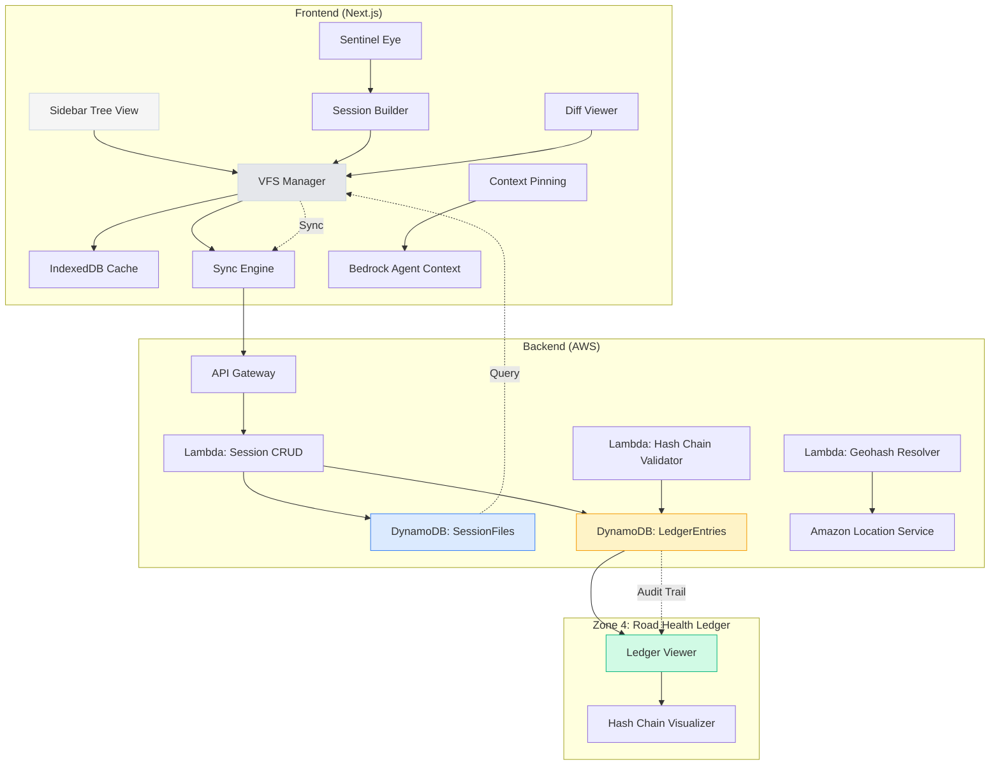
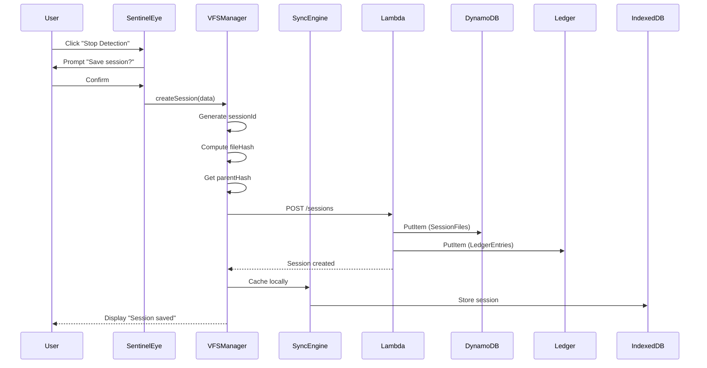
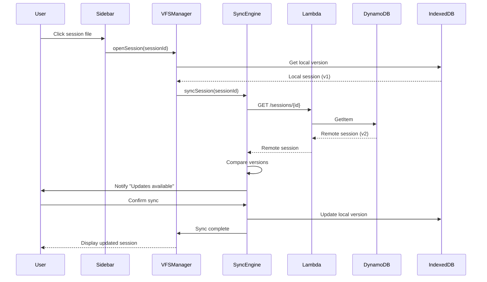

# VIGIA Map-as-a-File-System (MFS) - Design Document

## Architecture Overview

The MFS layer transforms geographical regions into a virtual file system where each "file" represents a road infrastructure session. The system uses a three-tier architecture:

1. **Frontend VFS Layer** (Next.js): Virtual file system abstraction with IndexedDB caching
2. **Backend Storage Layer** (DynamoDB): Persistent session metadata and hash chain ledger
3. **Sync Engine**: Bidirectional synchronization between local and remote state

---

## System Architecture Diagram



---

## Component Design

### 1. VFS Manager (Frontend)

**Purpose**: Abstraction layer that treats DynamoDB records as files in a hierarchical tree.

**Interface**:
```typescript
interface VFSManager {
  // File operations
  createSession(data: SessionData): Promise<SessionFile>;
  openSession(sessionId: string): Promise<SessionFile>;
  deleteSession(sessionId: string): Promise<void>;
  
  // Tree operations
  listSessions(path: string): Promise<SessionFile[]>;
  searchSessions(query: SearchQuery): Promise<SessionFile[]>;
  
  // Context operations
  pinSession(sessionId: string): void;
  unpinSession(sessionId: string): void;
  getPinnedContext(): SessionContext[];
  
  // Diff operations
  compareSessions(id1: string, id2: string): Promise<SessionDiff>;
  
  // Sync operations
  syncSession(sessionId: string): Promise<void>;
  syncAll(): Promise<void>;
}
```

**Implementation**:
```typescript
// packages/frontend/app/lib/vfs-manager.ts
export class VFSManager {
  private cache: IDBDatabase;
  private apiClient: APIClient;
  private syncQueue: SyncQueue;
  
  async createSession(data: SessionData): Promise<SessionFile> {
    // 1. Generate sessionId from geohash + timestamp
    const sessionId = `${data.geohash7}#${data.timestamp}`;
    
    // 2. Compute file hash
    const fileHash = await this.computeHash(data);
    
    // 3. Get parent hash from previous session
    const parentHash = await this.getParentHash(data.geohash7);
    
    // 4. Create session object
    const session: SessionFile = {
      sessionId,
      geohash7: data.geohash7,
      timestamp: data.timestamp,
      hazardCount: data.hazards.length,
      verifiedCount: data.hazards.filter(h => h.status === 'verified').length,
      contributorId: data.contributorId,
      fileHash,
      parentHash,
      status: 'draft',
      location: await this.resolveLocation(data.geohash7),
      hazards: data.hazards,
      metadata: data.metadata,
    };
    
    // 5. Write to DynamoDB
    await this.apiClient.createSession(session);
    
    // 6. Write to IndexedDB cache
    await this.cache.put('sessions', session);
    
    // 7. Update hash chain ledger
    await this.updateLedger(session, 'created');
    
    return session;
  }
  
  private async computeHash(data: SessionData): Promise<string> {
    const payload = `${data.geohash7}${data.timestamp}${data.hazards.length}${data.contributorId}`;
    const buffer = await crypto.subtle.digest('SHA-256', new TextEncoder().encode(payload));
    return Array.from(new Uint8Array(buffer)).map(b => b.toString(16).padStart(2, '0')).join('');
  }
}
```

---

### 2. Sidebar Tree View Component

**Purpose**: Hierarchical file explorer with lazy loading and virtualization.

**Component Structure**:
```typescript
// packages/frontend/app/components/SessionTree.tsx
interface SessionTreeProps {
  onFileOpen: (sessionId: string) => void;
  onFilePin: (sessionId: string) => void;
  onCompare: (id1: string, id2: string) => void;
}

export function SessionTree({ onFileOpen, onFilePin, onCompare }: SessionTreeProps) {
  const [tree, setTree] = useState<TreeNode[]>([]);
  const [selected, setSelected] = useState<string[]>([]);
  const [expanded, setExpanded] = useState<Set<string>>(new Set());
  
  // Lazy load children when folder is expanded
  const handleExpand = async (nodeId: string) => {
    if (expanded.has(nodeId)) {
      setExpanded(prev => {
        const next = new Set(prev);
        next.delete(nodeId);
        return next;
      });
    } else {
      const children = await vfsManager.listSessions(nodeId);
      setTree(prev => updateTreeNode(prev, nodeId, children));
      setExpanded(prev => new Set(prev).add(nodeId));
    }
  };
  
  return (
    <div className="h-full overflow-y-auto">
      <VirtualList
        height={600}
        itemCount={tree.length}
        itemSize={24}
        renderItem={(index) => (
          <TreeNode
            node={tree[index]}
            selected={selected.includes(tree[index].id)}
            onExpand={handleExpand}
            onSelect={handleSelect}
            onContextMenu={handleContextMenu}
          />
        )}
      />
    </div>
  );
}
```

**Tree Node Structure**:
```typescript
interface TreeNode {
  id: string; // Path or sessionId
  label: string; // Display name
  type: 'folder' | 'file';
  icon: string; // 📁 📄 ✅ 📌 🔄 📴 ⚠️ 🗄️
  children?: TreeNode[];
  metadata?: SessionMetadata;
  depth: number;
}
```

---

### 3. Sync Engine

**Purpose**: Bidirectional synchronization between IndexedDB and DynamoDB.

**Sync Strategy**:
```typescript
// packages/frontend/app/lib/sync-engine.ts
export class SyncEngine {
  private queue: SyncOperation[] = [];
  private isOnline: boolean = navigator.onLine;
  
  async syncSession(sessionId: string): Promise<void> {
    // 1. Check if online
    if (!this.isOnline) {
      this.queue.push({ type: 'sync', sessionId });
      return;
    }
    
    // 2. Get local version
    const local = await this.cache.get('sessions', sessionId);
    
    // 3. Get remote version
    const remote = await this.apiClient.getSession(sessionId);
    
    // 4. Compare versions
    if (!remote) {
      // Local-only: push to remote
      await this.apiClient.createSession(local);
    } else if (local.version < remote.version) {
      // Remote is newer: pull from remote
      await this.cache.put('sessions', remote);
      this.notifyUpdate(sessionId);
    } else if (local.version > remote.version) {
      // Local is newer: push to remote
      await this.apiClient.updateSession(local);
    } else {
      // Same version: no-op
    }
  }
  
  async syncAll(): Promise<void> {
    const sessions = await this.cache.getAll('sessions');
    await Promise.all(sessions.map(s => this.syncSession(s.sessionId)));
  }
  
  // Process queued operations when back online
  async processQueue(): Promise<void> {
    while (this.queue.length > 0) {
      const op = this.queue.shift()!;
      await this.syncSession(op.sessionId);
    }
  }
}
```

---

### 4. Context Pinning System

**Purpose**: Provide session context to Bedrock Agent for enhanced reasoning.

**Context Structure**:
```typescript
interface SessionContext {
  sessionId: string;
  geohash7: string;
  location: {
    continent: string;
    country: string;
    region: string;
    city: string;
  };
  hazards: {
    total: number;
    verified: number;
    types: Record<string, number>; // { POTHOLE: 5, CRACK: 3 }
  };
  history: {
    previousSessions: SessionSummary[]; // Last 10 in same geohash
    neighboringSessions: SessionSummary[]; // 8 adjacent geohashes
  };
  timestamp: string;
}
```

**Bedrock Agent Integration**:
```typescript
// packages/frontend/app/lib/bedrock-context.ts
export class BedrockContextManager {
  private pinnedSessions: Set<string> = new Set();
  
  async buildContext(): Promise<string> {
    const contexts = await Promise.all(
      Array.from(this.pinnedSessions).map(id => this.getSessionContext(id))
    );
    
    return `
You are analyzing road infrastructure data. The following sessions are pinned for context:

${contexts.map((ctx, i) => `
Session ${i + 1}:
- Location: ${ctx.location.city}, ${ctx.location.region}, ${ctx.location.country}
- Geohash: ${ctx.geohash7}
- Hazards: ${ctx.hazards.total} total (${ctx.hazards.verified} verified)
- Types: ${Object.entries(ctx.hazards.types).map(([k, v]) => `${k}: ${v}`).join(', ')}
- Historical context: ${ctx.history.previousSessions.length} previous sessions in this area
`).join('\n')}

Use this context to provide informed analysis and recommendations.
    `.trim();
  }
}
```

---

### 5. Diff Viewer Component

**Purpose**: Visual comparison of two sessions with delta calculation.

**Component Structure**:
```typescript
// packages/frontend/app/components/DiffViewer.tsx
interface DiffViewerProps {
  session1: SessionFile;
  session2: SessionFile;
}

export function DiffViewer({ session1, session2 }: DiffViewerProps) {
  const diff = useMemo(() => calculateDiff(session1, session2), [session1, session2]);
  
  return (
    <div className="grid grid-cols-[1fr_200px_1fr] h-full">
      {/* Left pane: Session 1 */}
      <div className="border-r border-ide-border">
        <SessionMapView session={session1} highlightHazards={diff.resolvedHazards} />
      </div>
      
      {/* Center: Diff summary */}
      <div className="bg-ide-panel p-4 flex flex-col justify-center">
        <div className="text-center space-y-2">
          <div className={`text-2xl font-bold ${diff.delta.hazards > 0 ? 'text-red-500' : 'text-green-500'}`}>
            {diff.delta.hazards > 0 ? '+' : ''}{diff.delta.hazards}
          </div>
          <div className="text-xs text-ide-text-secondary">Hazards</div>
          
          <div className={`text-lg ${diff.delta.verificationRate > 0 ? 'text-green-500' : 'text-red-500'}`}>
            {diff.delta.verificationRate > 0 ? '+' : ''}{(diff.delta.verificationRate * 100).toFixed(1)}%
          </div>
          <div className="text-xs text-ide-text-secondary">Verification Rate</div>
          
          <div className="text-sm text-yellow-500">
            {diff.newHazards.length} new
          </div>
          <div className="text-sm text-green-500">
            {diff.resolvedHazards.length} resolved
          </div>
        </div>
      </div>
      
      {/* Right pane: Session 2 */}
      <div className="border-l border-ide-border">
        <SessionMapView session={session2} highlightHazards={diff.newHazards} />
      </div>
    </div>
  );
}

function calculateDiff(s1: SessionFile, s2: SessionFile): SessionDiff {
  const delta = {
    hazards: s2.hazardCount - s1.hazardCount,
    verificationRate: (s2.verifiedCount / s2.hazardCount) - (s1.verifiedCount / s1.hazardCount),
  };
  
  const newHazards = s2.hazards.filter(h2 => 
    !s1.hazards.some(h1 => h1.geohash === h2.geohash)
  );
  
  const resolvedHazards = s1.hazards.filter(h1 => 
    !s2.hazards.some(h2 => h2.geohash === h1.geohash)
  );
  
  return { delta, newHazards, resolvedHazards };
}
```

---

### 6. Hash Chain Ledger Integration

**Purpose**: Map ledger entries to sidebar tree for auditability.

**Ledger Viewer Component**:
```typescript
// packages/frontend/app/components/LedgerViewer.tsx
export function LedgerViewer() {
  const [entries, setEntries] = useState<LedgerEntry[]>([]);
  const [selectedSession, setSelectedSession] = useState<string | null>(null);
  
  // Fetch ledger entries for selected session
  useEffect(() => {
    if (selectedSession) {
      fetchLedgerEntries(selectedSession).then(setEntries);
    }
  }, [selectedSession]);
  
  return (
    <div className="font-data text-xs">
      <table className="w-full border-collapse">
        <thead>
          <tr className="border-b border-ide-border text-ide-text-secondary">
            <th className="py-2 px-3 text-left">Timestamp</th>
            <th className="py-2 px-3 text-left">Action</th>
            <th className="py-2 px-3 text-left">Hash</th>
            <th className="py-2 px-3 text-left">Valid</th>
          </tr>
        </thead>
        <tbody>
          {entries.map((entry, i) => (
            <tr key={i} className="border-b border-ide-border hover:bg-ide-hover">
              <td className="py-2 px-3">{new Date(entry.timestamp).toLocaleString()}</td>
              <td className="py-2 px-3">{entry.action}</td>
              <td className="py-2 px-3 font-mono text-[10px]">{entry.currentHash.slice(0, 12)}...</td>
              <td className="py-2 px-3">
                {validateHashChain(entry, entries[i - 1]) ? '✅' : '⚠️'}
              </td>
            </tr>
          ))}
        </tbody>
      </table>
    </div>
  );
}

function validateHashChain(current: LedgerEntry, previous?: LedgerEntry): boolean {
  if (!previous) return current.previousHash === 'genesis';
  return current.previousHash === previous.currentHash;
}
```

---

## API Design

### Lambda Functions

**1. Session CRUD Lambda**:
```typescript
// packages/backend/src/sessions/handler.ts
export async function handler(event: APIGatewayEvent) {
  const { httpMethod, pathParameters, body } = event;
  
  switch (httpMethod) {
    case 'POST': // Create session
      return createSession(JSON.parse(body));
    case 'GET': // Get session
      return getSession(pathParameters.sessionId);
    case 'PUT': // Update session
      return updateSession(pathParameters.sessionId, JSON.parse(body));
    case 'DELETE': // Delete session
      return deleteSession(pathParameters.sessionId);
  }
}

async function createSession(data: SessionData) {
  // 1. Validate input
  // 2. Write to DynamoDB
  // 3. Update hash chain
  // 4. Return session object
}
```

**2. Geohash Resolver Lambda**:
```typescript
// packages/backend/src/geohash/resolver.ts
export async function handler(event: { geohash7: string }) {
  const { geohash7 } = event;
  
  // 1. Decode geohash to lat/lon
  const { lat, lon } = decodeGeohash(geohash7);
  
  // 2. Reverse geocode using Amazon Location Service
  const location = await locationClient.searchPlaceIndexForPosition({
    IndexName: 'VigiaPlaceIndex',
    Position: [lon, lat],
  });
  
  // 3. Extract hierarchy
  return {
    continent: extractContinent(location),
    country: location.Country,
    region: location.Region,
    city: location.Municipality,
  };
}
```

**3. Hash Chain Validator Lambda**:
```typescript
// packages/backend/src/ledger/validator.ts
export async function handler(event: { sessionId: string }) {
  const { sessionId } = event;
  
  // 1. Query ledger entries for session
  const entries = await queryLedgerEntries(sessionId);
  
  // 2. Validate chain
  for (let i = 1; i < entries.length; i++) {
    const current = entries[i];
    const previous = entries[i - 1];
    
    if (current.previousHash !== previous.currentHash) {
      return { valid: false, brokenAt: i };
    }
  }
  
  return { valid: true };
}
```

---

## Data Flow Diagrams

### Session Creation Flow



### Sync-on-Open Flow



---

## Cost Optimization Strategy

### DynamoDB Optimization

**1. Partition Key Design**:
- Use `userId` as partition key to distribute load
- Use `sessionId` (geohash7#timestamp) as sort key for efficient queries
- Avoid hot partitions by prefixing with user ID

**2. GSI Strategy**:
- GSI-1 (`geohash7-timestamp-index`): Query sessions by location
- GSI-2 (`status-timestamp-index`): Query by status (draft/finalized/archived)
- Limit GSIs to 2 to stay within Free Tier

**3. Data Compression**:
- Compress hazard arrays using gzip before storing
- Target: 50% size reduction (e.g., 10 KB → 5 KB per session)
- Estimated savings: 50% reduction in storage costs

**4. TTL for Auto-Deletion**:
- Set TTL on archived sessions (90 days)
- Automatically delete old data to stay within 25 GB Free Tier limit
- Estimated capacity: ~5,000 sessions (5 KB each) = 25 MB

**5. Batch Operations**:
- Use `BatchWriteItem` (up to 25 items) for bulk inserts
- Reduces request count by 25x
- Example: 1,000 sessions = 40 batch requests instead of 1,000 individual requests

### Lambda Optimization

**1. Memory Allocation**:
- Session CRUD: 256 MB (sufficient for JSON parsing)
- Geohash Resolver: 512 MB (Amazon Location Service calls)
- Hash Chain Validator: 128 MB (simple computation)

**2. Cold Start Mitigation**:
- Use Lambda SnapStart for Java/Node.js functions
- Keep functions warm with CloudWatch Events (1 invocation/5 minutes)
- Free Tier: 1M requests/month (sufficient for demo)

### IndexedDB Caching

**1. Cache Strategy**:
- Store last 100 opened sessions locally
- Evict LRU (Least Recently Used) when cache exceeds 500 MB
- Reduces DynamoDB read requests by ~80%

**2. Offline Support**:
- Queue write operations when offline
- Sync when back online
- Reduces failed requests and retry costs

### Estimated Monthly Cost

| Service | Usage | Cost |
|---------|-------|------|
| DynamoDB (SessionFiles) | 25 GB storage, 100 RCU/WCU | Free Tier |
| DynamoDB (LedgerEntries) | 5 GB storage, 50 RCU/WCU | Free Tier |
| Lambda (Session CRUD) | 100K invocations, 256 MB | Free Tier |
| Lambda (Geohash Resolver) | 10K invocations, 512 MB | Free Tier |
| Lambda (Hash Chain Validator) | 5K invocations, 128 MB | Free Tier |
| Amazon Location Service | 10K reverse geocode requests | $0.40 |
| API Gateway | 100K requests | Free Tier |
| **Total** | | **$0.40/month** |

**Headroom**: $199.60 remaining for scaling during voting phase.

---

## Security Considerations

### 1. Authentication
- Use AWS Cognito for user authentication
- Scope all DynamoDB queries to authenticated user ID
- Free Tier: 50,000 MAUs (Monthly Active Users)

### 2. Authorization
- IAM policies restrict Lambda access to specific DynamoDB tables
- API Gateway uses Cognito authorizer
- No public read/write access to DynamoDB

### 3. Data Encryption
- DynamoDB encryption at rest (default, no extra cost)
- HTTPS for all API calls (enforced by API Gateway)
- Optional: KMS encryption for sensitive fields (20,000 requests/month Free Tier)

### 4. Hash Chain Integrity
- SHA-256 hashing prevents tampering
- Ledger entries are append-only (no updates/deletes)
- Validation on every session open

---

## Testing Strategy

### 1. Unit Tests
- VFSManager: Test file operations (create, open, delete)
- SyncEngine: Test sync logic (local vs remote version comparison)
- Hash chain validator: Test integrity checks

### 2. Integration Tests
- End-to-end session creation flow
- Sync-on-open with mock DynamoDB
- Diff calculation with sample sessions

### 3. Performance Tests
- Sidebar rendering with 10,000 files (virtualization)
- Diff calculation with 1,000 hazards per session
- Hash chain validation with 1,000 entries

---

## Deployment Checklist

- [ ] Create DynamoDB tables (SessionFiles, LedgerEntries)
- [ ] Deploy Lambda functions (Session CRUD, Geohash Resolver, Hash Chain Validator)
- [ ] Configure API Gateway endpoints
- [ ] Set up Cognito user pool
- [ ] Create Amazon Location Service Place Index
- [ ] Configure IndexedDB schema in frontend
- [ ] Test session creation flow
- [ ] Test sync-on-open flow
- [ ] Test diff viewer
- [ ] Validate hash chain integrity
- [ ] Monitor DynamoDB usage (stay within Free Tier)

---

## Future Enhancements

1. **Real-time Collaboration**: Use WebSockets (AWS AppSync) for multi-user editing
2. **Branching/Merging**: Git-like version control for sessions
3. **Session Templates**: Pre-configured session types (highway, urban, rural)
4. **Bulk Export**: Export multiple sessions as ZIP archive
5. **Advanced Search**: Full-text search using Amazon OpenSearch (if budget allows)
